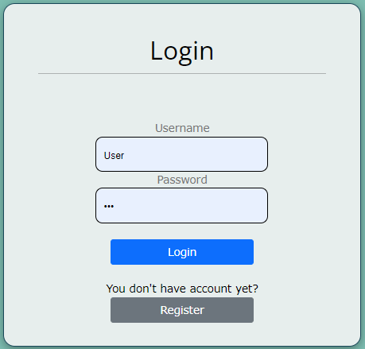

#  Virtual Wallet
Transfer money quick, safe, and free

# 

## Walkthrough

Virtual Wallet MaxKashMate is a web-based application designed to empower users in efficiently managing their finances. The platform offers essential functionalities, including the ability to send and receive money between users and to facilitate deposits from a bank into the application's wallet, and vice versa.

The chosen name, "MaxKashMate," holds a special place in our project's heart. This name isn't just a random selection; it's been carefully crafted to perfectly align with the app's purpose while paying a friendly tribute to the names of its developers. You might notice a playful twist with intentional misspelling, which adds a touch of creativity and fun to the name. This way, we aim to make the app not only well-developed, but also to bring a smile to your face every time you use it.
 
 

### Public Part 

> The public section doesn't require authentication and showcases a self-rotating carousel featuring product advertisements, along with buttons for both Login and Registration. 
Anonymous users need to either register or login to begin using the app.
 

### Private Part 
##### Registration and confirmation  

> Upon successful user registration, the system will send a confirmation email to verify the user's email address. When the user clicks on the link within the email, the system will redirect them back to our website, allowing them to log in. Users who have not completed email verification are not considered registered. 
Users who successfully log in are automatically redirected to a welcome page, where they can immediately start using the app.
 

Additional details for registration

• Username  
    o Must be at least 2 characters long 
    o Maximum of 20 characters long 
    o Mandatory and cannot be edited 
    o Must be unique within the system 

• Email  
    o Required and can be changed 
    o Must be unique within the system 
    o Email format verification (regex) 

• Phone Number  
    o Required and can be changed 
    o Must be exactly 10 digits 

• First Name  
    o Not required and can be changed 
    o Maximum of 20 characters long 

• Last Name  
    o Not required and can be changed 
    o Maximum of 20 characters long 

• Password  
    o Required and can be changed 
    o Must be at least 8 characters long 
    o Maximum of 20 characters long 
    o Must include uppercase and lowercase character 
    o Must include digit and symbol 
    o NB! Provided password is not recorded in the database directly 

• Confirm Password  
    o Must match the Password 

# 

Additional details for Login

• Username  
• Password  

# 

##### There are two user roles in the system: "user" and "administrator".  

##### Users  
> Registered users have access to their user profile page, where they can view the information provided during registration. 
Users can upload a profile image, update their email, phone number, first and last name, and password. 
The requirements for modifying a field are identical to those of the registration form.  
Each page displays the current field value, and changing the password necessitates inputting the current password.

# 

##### Wallets  
> The most vital aspect of the app is the user wallet. This is where users store their money. After successful registration, each user must add a wallet to their account. 
This can be done by clicking on the "My Wallet" button. If the user doesn't have a wallet, "Create Wallet" button will appear.  
Users must select the currency for the wallet—BGN, EUR, or USD. 
Once created, the wallet will be showcased on the info page. 
Users can view their wallet details, where they can update or remove the wallet. 
The "Update wallet" option allows users to change the wallet's currency. 
Note: Updating the wallet currency will automatically recalculate the balance based on real-time exchange rates.

# 

##### Right side panel  
> For an enhanced user experience, the app features two persistent panels on the right side of every page. 
The first panel displays the current wallet balance and its corresponding currency. 
The second panel houses a currency converter that offers real-time calculations for currency exchange rates.

# 

##### Cards  
> Another essential feature for a completed account is the user's cards. 
To view their cards or add a new one, users should navigate to the "My Cards" section, where all cards associated with the user will be showcased. 
The "Add Card" button provides access to the corresponding page for card addition.

# 

Additional details for adding card

• Card Name  
    o Required 
    o Must be at least 3 characters long 
    o Maximum of 16 characters long 
    o Must be unique within the user's cards 

• Card Number  
    o Required 
    o Must be unique within the user's cards 

• Expiration Date (MMyy)  
    o Required 
    o Date format Month Year 

• Cardholder  
    o Required 
    o Date format Month Year 
    o Must be at least 2 characters long 
    o Maximum of 30 characters long 

• Check Number  
    o Required 
    o Must exactly 3 digits long 

• Currency  
    o Required 
    o Supported currencies - BGN, EUR, USD 

• Card Type:  
    o Required 
    o Types - Debit or Credit 

##### Welcome page logged user  
> Upon logging in, users will be directed to a welcome page where they will find an overview, that includes details about their last three transactions and a chart providing information about the count of the transactions types they have made. 

# 

##### Transactions  
> Once a user has both a wallet and a valid card, they are all set to initiate transactions. The app offers three distinct types of transactions that users can engage in. 

# 

##### Transfer  
> This transaction enables users to transfer funds from their wallet to another user's wallet. 

Additional details for Transfer

• Select Recipient  
    o User should select recipient username from a list 
    o Can search the list for user by username, phone number and email 

• Create Transfer  
    o Shows the selected username for recepient 
    o Field for amount that should be sent 
    o Description field 
    o Both fields are required. 

• Successful transafer will be made if  
    o The amount is in decimal format 
    o The amount is less than or equal to the wallet's amount 
    o Description is at least 2 and not more than 150 characters long 
    o Recipient has wallet in the system 
    o Action is confirmed 

• Successful transafer will send email with notification to the recipient 

##### Deposit  
> This transaction enables users to transfer funds from any of their cards to their wallet. 

Additional details for Deposit

• Create Deposit  
    o Field for amount that should be deposited 
    o List of user's cards 
    o Description field 
    o All fields are required. 

• Successful deposit will be made if  
    o The amount is in decimal format 
    o The amount is less than or equal to the wallet's amount 
    o The user has wallet and card 
    o Description is at least 2 and not more than 150 characters long 
    o Action is confirmed 

##### Withdraw  
> This transaction enables users to transfer funds from their wallet to their cards. 

Additional details for Withdraw

• Create Withdraw  
    o Field for amount that should be withdrawed 
    o List of user's cards 
    o Description field 
    o All fields are required. 

• Successful withdraw will be made if  
    o The amount is in decimal format 
    o The amount is less than or equal to the wallet's amount 
    o The user has wallet and card 
    o Description is at least 2 and not more than 150 characters long 
    o Action is confirmed 

> On successful transaction, the user is redirected to the trnsaction info page. 

##### Transactions Info  
> Each user has access to all transactions concerning him, transactions he made and transactions that was send to him. 
Access to the page is given via button in the left side. 
This page provides list of all transactions, option to view details for each transaction and search options. 
The search options are listed in expandable button and can be variously combined.

# 

### Administrative Part 

> Administrators have the responsibility of managing users. They are granted access to a dashboard that displays a list of all users and allows them to search for users by phone number, username, or email. Administrators have the authority to promote or demote users, as well as to block, unblock, and delete users. 
Additionally, administrators have the capability to view lists of all users' cards and their corresponding details, as well as comprehensive information about all users' wallets and their associated details. 
Last, but not least, administrators can access list of all transactions made by all users, view each transaction details and again search options.

# 

### Database Diagram  

# 

### Additionals  

> Next to app's logo home button, there is button for access to app's REST API via Swagger. 
Accessing external links and being inactive for 15 minutes from the system, will cause user logout. 
There is also a privacy and policy button. There could be found standart text for real-world web wallet app  and bit of humorius part added for fun! 
Interactive footer with company and project developers team info, could be found at the bottom pf the page.
 
 

Technological Info

o C#, ASP.NET Core MVC 
o HTML, CSS, JavaScript 
o Microsoft EntityFrameworkCore SqlServer 
o AutoMapper Extensions Microsoft DependencyInjection 
o Microsoft AspNetCore Mvc NewtonsoftJson 
o MailKit integration 
o ExchangeRateAPI integration 
o Microsoft NET Test Sdk 

  

## Thank you for your attention!
